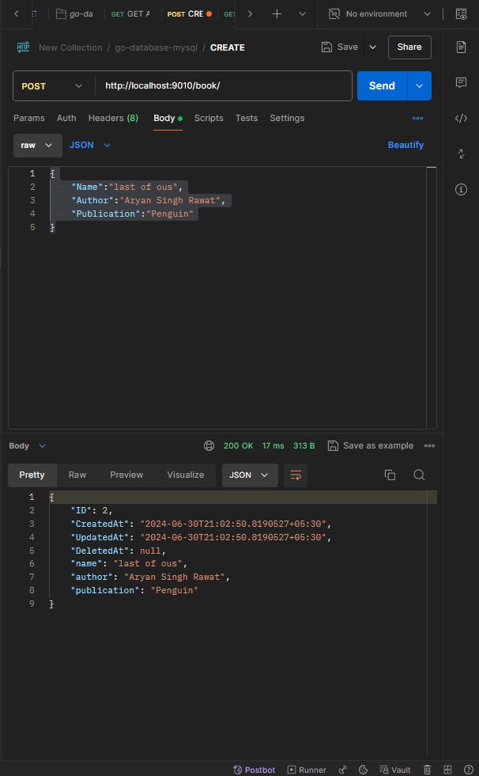
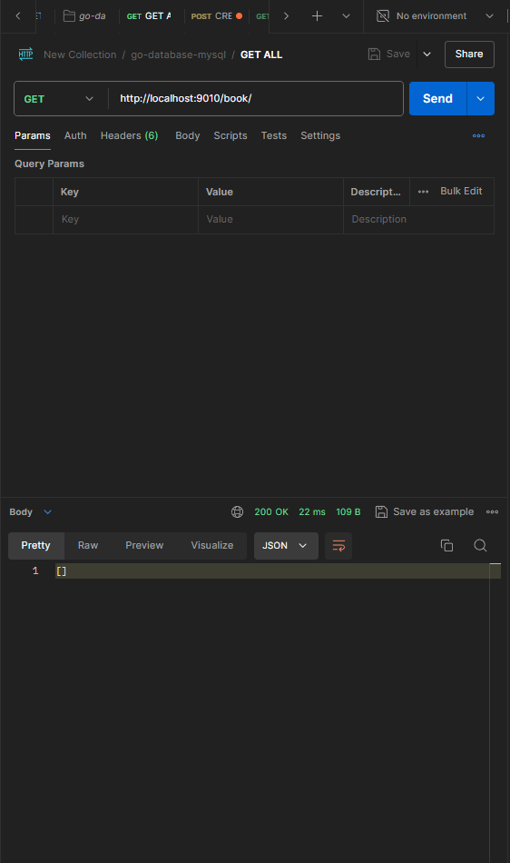
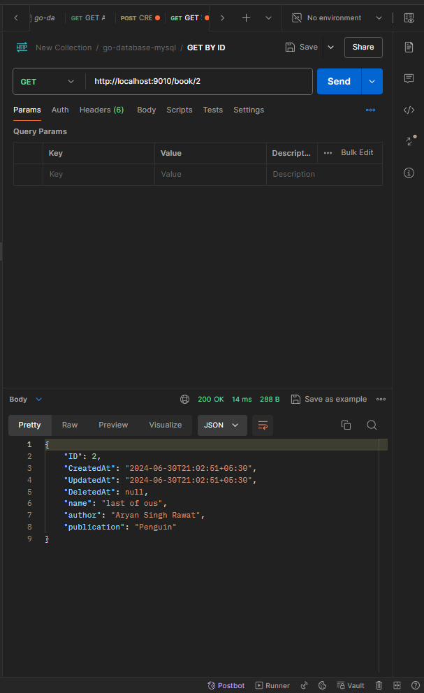
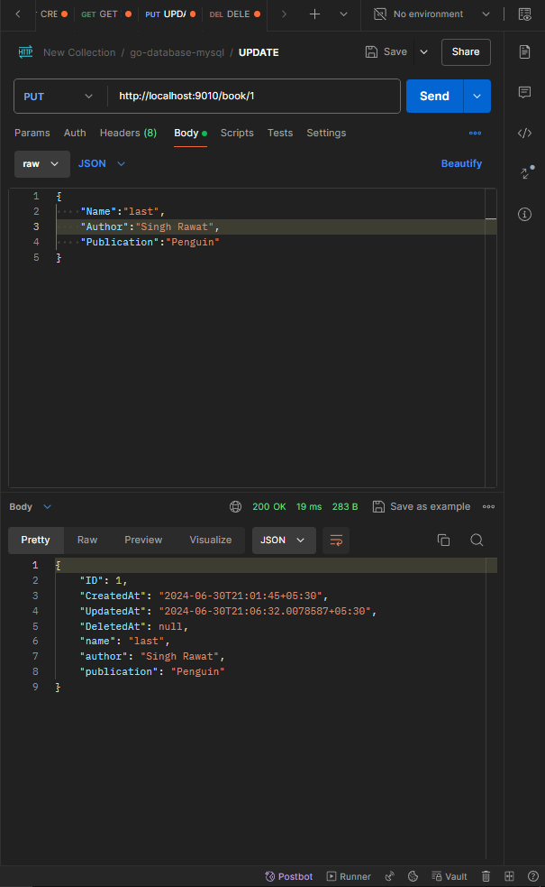
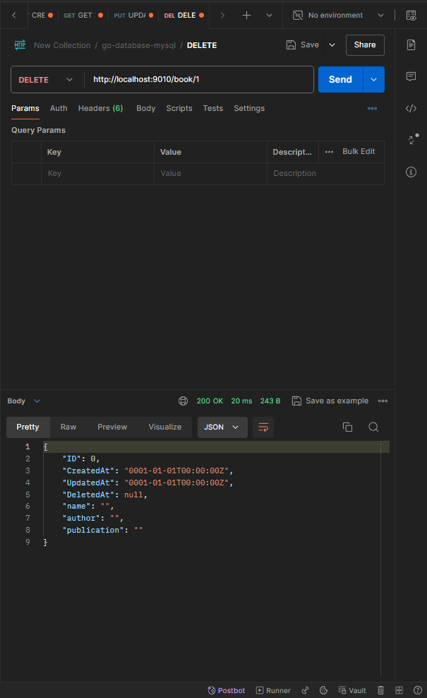

# Go-Database-MySQL 📚

This is a simple Bookstore API built with Go and MySQL. It uses the Gorilla Mux router for routing and Gorm for ORM.

## Getting Started 🚀

Follow these instructions to set up and run the application on your local machine.

### Prerequisites

- Go 1.16 or higher
- MySQL database

### MySQL Setup

1. **Install MySQL:**

   If you don't have MySQL installed, download and install it from the [official MySQL website](https://dev.mysql.com/downloads/mysql/).

2. **Create a database:**

   Open your MySQL command line client or any MySQL GUI tool and execute the following command to create a new database:

   ```sql
   CREATE DATABASE bookdb;
   ```

### Setup

1. **Clone the repository:**

   ```sh
   git clone https://github.com/aryanraw/go-database-mysql.git
   cd go-database-mysql
   ```

2. **Update MySQL configuration:**

   Update the `Connect` function in `pkg/config/app.go` with your MySQL username, password, IP, port, and database name.

3. **Run the application:**

   ```sh
   go run cmd/main/main.go
   ```

   The server will start on `localhost:9010`.

## Built With 🛠️

- [Go](https://golang.org/) - The programming language used
- [Gorilla Mux](https://github.com/gorilla/mux) - Router for handling HTTP requests
- [Gorm](https://gorm.io/) - ORM library for Go
- [MySQL](https://www.mysql.com/) - Database

## API Endpoints 📋

### Create a Book 📘

- **URL:** `/book/`
- **Method:** `POST`
- **Request Body:**

  ```json
  {
      "name": "Book Name",
      "author": "Author Name",
      "publication": "Publication Name"
  }
  ```

- **Response:**

  ```json
  {
      "ID": 1,
      "CreatedAt": "2024-06-30T12:34:56Z",
      "UpdatedAt": "2024-06-30T12:34:56Z",
      "DeletedAt": null,
      "name": "Book Name",
      "author": "Author Name",
      "publication": "Publication Name"
  }
  ```

- **Example:**

  

### Get All Books 📚

- **URL:** `/book/`
- **Method:** `GET`
- **Response:**

  ```json
  [
      {
          "ID": 1,
          "CreatedAt": "2024-06-30T12:34:56Z",
          "UpdatedAt": "2024-06-30T12:34:56Z",
          "DeletedAt": null,
          "name": "Book Name",
          "author": "Author Name",
          "publication": "Publication Name"
      }
  ]
  ```

- **Example:**

  

### Get Book by ID 📗

- **URL:** `/book/{bookId}`
- **Method:** `GET`
- **Response:**

  ```json
  {
      "ID": 1,
      "CreatedAt": "2024-06-30T12:34:56Z",
      "UpdatedAt": "2024-06-30T12:34:56Z",
      "DeletedAt": null,
      "name": "Book Name",
      "author": "Author Name",
      "publication": "Publication Name"
  }
  ```

- **Example:**

  

### Update a Book 📙

- **URL:** `/book/{bookId}`
- **Method:** `PUT`
- **Request Body:**

  ```json
  {
      "name": "Updated Book Name",
      "author": "Updated Author Name",
      "publication": "Updated Publication Name"
  }
  ```

- **Response:**

  ```json
  {
      "ID": 1,
      "CreatedAt": "2024-06-30T12:34:56Z",
      "UpdatedAt": "2024-06-30T12:40:56Z",
      "DeletedAt": null,
      "name": "Updated Book Name",
      "author": "Updated Author Name",
      "publication": "Updated Publication Name"
  }
  ```

- **Example:**

  

### Delete a Book 🗑️

- **URL:** `/book/{bookId}`
- **Method:** `DELETE`
- **Response:**

  ```json
  {
      "ID": 1,
      "DeletedAt": "2024-06-30T12:45:56Z"
  }
  ```

- **Example:**

  
